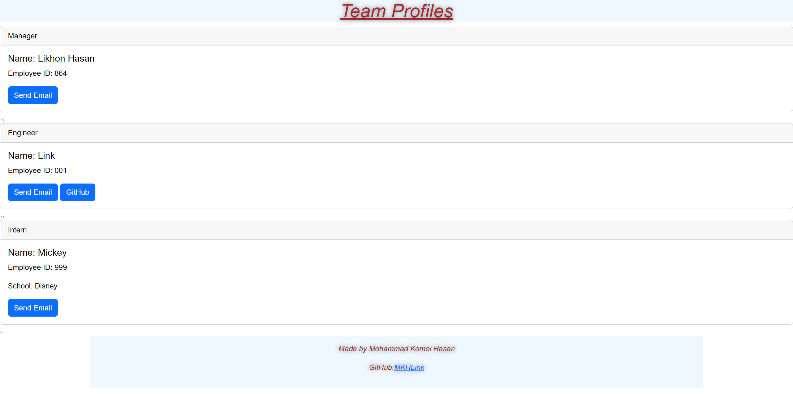

# Title
Team Profile Generator

# Table of Contents
[Description](#description)

[Installation](#instalation)

[Usage](#usage)

[License](#license)

[Contributors](#contributors)

[Tests](#tests)

[Questions](#questions)

## Description
This node js app can be used to generate a website for quick and easy access to team members' emal and github.

## Installation
Download the Repo and use npm i to install the dependencies, and use node index in cmd line to start the application

## Usage
For team managers to keep track of their employees and have easy access to their info

## Walkthrough Video
https://drive.google.com/file/d/16wu1AfSbT6sE1SZuIHUKBDOXTdjGnOSm/view

## Contribution
Mohammad Komol Hasan

## Tests
All the test for the program are in the   __test__ folder, simplay type npm run test in terminal to initate tests

## Questions
GitHub: MKHLink

Email: likhonhasankomol@gmail.com
    